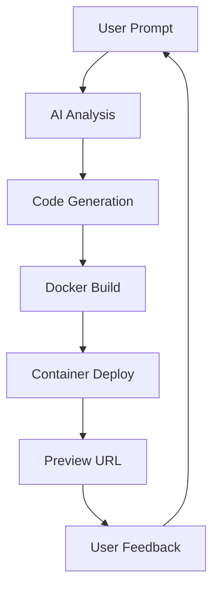

# Kapsules: Complete Developer Guide

## 🏗️ Application Overview

**Kapsules** is an AI-driven web application platform that transforms natural language prompts into fully functional, containerized web applications. Built with Next.js, React, TypeScript, and Docker, it provides a complete pipeline from idea to deployment.

## 📋 Table of Contents

1. [Tech Stack & Architecture](#tech-stack--architecture)
2. [Project Structure](#project-structure)
3. [Core Components](#core-components)
4. [AI Pipeline](#ai-pipeline)
5. [Docker Integration](#docker-integration)
6. [Database Layer](#database-layer)
7. [Authentication](#authentication)
8. [UI/UX Framework](#uiux-framework)
9. [API Layer](#api-layer)
10. [Testing Framework](#testing-framework)
11. [Development Workflow](#development-workflow)
12. [Deployment](#deployment)
13. [Environment Configuration](#environment-configuration)

---

## 🛠️ Tech Stack & Architecture

### Frontend Stack
- **Next.js 15** - React framework with App Router
- **React 19** - UI library with latest features
- **TypeScript 5** - Type-safe development
- **Tailwind CSS 4** - Utility-first styling
- **Shadcn/ui** - Modern component library
- **Radix UI** - Accessible primitive components

### Backend & Infrastructure
- **Supabase** - PostgreSQL database with real-time features
- **Docker** - Containerization and deployment
- **OpenAI API** - AI code generation
- **Node.js** - Server-side runtime
- **Docker Compose** - Multi-container orchestration

### Development Tools
- **Jest** - Unit testing framework
- **Playwright** - End-to-end testing
- **ESLint** - Code linting
- **Prettier** - Code formatting
- **TypeScript** - Static type checking

---

## 📁 Project Structure

```
kapsules/
├── 📁 app/                          # Next.js App Router
│   ├── 📁 api/                      # API routes
│   │   ├── 📁 generate-project/     # AI project generation
│   │   ├── 📁 preview/              # Project preview endpoints
│   │   ├── 📁 health/               # Health check
│   │   └── 📁 ai-iterate/           # AI iteration endpoints
│   ├── 📁 auth/                     # Authentication pages
│   ├── 📁 projects/                 # Projects management
│   ├── 📁 portfolio/                # User portfolio
│   ├── 📁 settings/                 # User settings
│   ├── layout.tsx                   # Root layout
│   ├── page.tsx                     # Landing page
│   └── providers.tsx                # Context providers
├── 📁 components/                   # React components
│   ├── 📁 auth/                     # Authentication components
│   ├── 📁 projects/                 # Project-related components
│   ├── 📁 ui/                       # Reusable UI components
│   └── 📁 landing/                  # Landing page components
├── 📁 lib/                          # Core business logic
│   ├── docker-service.ts            # Docker container management
│   ├── project-pipeline.ts          # AI generation pipeline
│   ├── features.ts                  # Feature flags
│   └── utils.ts                     # Utility functions
├── 📁 hooks/                        # Custom React hooks
├── 📁 contexts/                     # React contexts
├── 📁 utils/                        # Supabase utilities
├── 📁 templates/                    # Project templates
│   └── 📁 default/                  # Default Vite React template
├── 📁 generated/                    # AI-generated projects
├── 📁 scripts/                      # Build and deployment scripts
├── 📁 __tests__/                    # Test files
├── 📁 docs/                         # Documentation
├── docker-compose.yml               # Production orchestration
├── docker-compose.dev.yml           # Development environment
├── Dockerfile                       # Production image
├── Dockerfile.dev                   # Development image
└── package.json                     # Dependencies and scripts
```

---

## 🧩 Core Components

### 1. Landing Page (`app/page.tsx`)
The main entry point showcasing the platform's capabilities with hero section, features, and project examples.

### 2. Projects Interface (`components/projects/ProjectsContent.tsx`)
**Key Features:**
- AI chat interface for project generation
- Real-time build status tracking
- Project preview integration
- Project management and iteration

**Core Functionality:**
```typescript
// Project generation flow
const handleSubmit = async (prompt: string) => {
  // 1. Create project record
  const { data: project } = await supabase
    .from('projects')
    .insert({ prompt, user_id })
    .select()
    .single();

  // 2. Process through AI pipeline
  await projectPipelineService.processProject(project);
  
  // 3. Build and deploy container
  // 4. Provide live preview URL
};
```

### 3. AI Chat Interface (`components/projects/AIChatInterface.tsx`)
Real-time conversational interface for:
- Project prompt input
- Build status updates
- Interactive refinement
- Error handling and recovery

### 4. Authentication System (`components/auth/`)
- **AuthModal.tsx** - Login/signup modal
- **UserDropdown.tsx** - User menu and profile
- **ProtectedRoute.tsx** - Route protection wrapper

---

## 🤖 AI Pipeline

### Core Pipeline (`lib/project-pipeline.ts`)

The AI pipeline transforms natural language prompts into deployable applications through these stages:

#### Stage 1: AI Analysis
```typescript
async analyzePromptWithAI(prompt: string) {
  // Analyze prompt to extract:
  // - Project type (web-app, dashboard, etc.)
  // - Required features (auth, database, API)
  // - UI components needed
  // - Complexity assessment
}
```

#### Stage 2: Code Generation
```typescript
async generateViteApp(aiInterpretation, prompt) {
  // Generate complete Vite/React/TypeScript project:
  // - package.json with dependencies
  // - Vite configuration
  // - React components
  // - TypeScript definitions
  // - Styling (Tailwind CSS)
}
```

#### Stage 3: Docker Build
```typescript
async buildDockerContainer(projectId, sourceFiles) {
  // 1. Create project directory
  // 2. Copy template files
  // 3. Write generated source files
  // 4. Build Docker image
  // 5. Run container with port assignment
}
```

#### Stage 4: Deployment
```typescript
async deployToSandbox(containerId, projectId) {
  // Deploy to isolated sandbox environment
  // Return live preview URL
}
```

### Build Status Tracking
Each stage updates the database with real-time status:
```typescript
interface BuildStage {
  stage: 'ai_analysis' | 'code_gen' | 'build' | 'deploy';
  status: 'started' | 'completed' | 'failed';
  message?: string;
  metadata?: Record<string, unknown>;
}
```

---

## 🐳 Docker Integration

### Docker Service (`lib/docker-service.ts`)

Manages the complete container lifecycle:

#### Container Building
```typescript
async buildProjectContainer(projectId: string, sourceFiles: Record<string, string>) {
  // 1. Create project workspace
  // 2. Copy template files
  // 3. Write generated code
  // 4. Build Docker image
  // 5. Run container with auto-assigned port
  // 6. Return container info and preview URL
}
```

#### Port Management
- **Dynamic allocation** - Ports 8080-9000
- **Conflict resolution** - Automatic port assignment
- **Resource tracking** - Monitor used ports

#### Container Lifecycle
```typescript
// Start container
const result = await dockerService.buildProjectContainer(id, files);

// Get container status
const info = await dockerService.getContainerInfo(containerId);

// Stop container
await dockerService.stopContainer(containerId);

// Clean up resources
await dockerService.removeContainer(containerId);
```

### Multi-Environment Support

#### Development (`docker-compose.dev.yml`)
- Hot reload for Next.js app
- Local Supabase instance
- Development-optimized builds
- Volume mounts for live editing

#### Production (`docker-compose.yml`)
- Standalone Next.js build
- Redis for caching
- Docker-in-Docker for project containers
- Health checks and restart policies

---

## 🗄️ Database Layer

### Supabase Integration (`utils/supabase/`)

#### Client Configuration
```typescript
// Browser client
export const createClient = () =>
  createBrowserClient(
    process.env.NEXT_PUBLIC_SUPABASE_URL!,
    process.env.NEXT_PUBLIC_SUPABASE_ANON_KEY!
  );

// Server client  
export const createServerClient = () =>
  createServerClient(
    process.env.NEXT_PUBLIC_SUPABASE_URL!,
    process.env.SUPABASE_SERVICE_ROLE_KEY!
  );
```

#### Database Schema
```sql
-- Projects table
projects (
  id UUID PRIMARY KEY,
  user_id UUID REFERENCES auth.users,
  prompt TEXT NOT NULL,
  preview_url TEXT,
  docker_image_id TEXT,
  source_files JSONB,
  ai_interpretation JSONB,
  build_status JSONB,
  created_at TIMESTAMP,
  updated_at TIMESTAMP
);

-- Build status tracking
build_stages (
  id UUID PRIMARY KEY,
  project_id UUID REFERENCES projects,
  stage TEXT,
  status TEXT,
  message TEXT,
  metadata JSONB,
  created_at TIMESTAMP
);
```

#### Real-time Features
- **Live build updates** - Real-time status tracking
- **Collaborative editing** - Multi-user project access
- **Change notifications** - Instant UI updates

---

## 🔐 Authentication

### Auth Context (`contexts/AuthContext.tsx`)
```typescript
interface AuthContext {
  user: User | null;
  loading: boolean;
  signIn: (email: string, password: string) => Promise<void>;
  signUp: (email: string, password: string) => Promise<void>;
  signOut: () => Promise<void>;
}
```

### Protected Routes
```typescript
function ProtectedRoute({ children }: { children: React.ReactNode }) {
  const { user, loading } = useAuth();
  
  if (loading) return <Loading />;
  if (!user) return <AuthModal />;
  
  return <>{children}</>;
}
```

### Auth Callbacks (`app/auth/callback/`)
Handles OAuth redirects and session management.

---

## 🎨 UI/UX Framework

### Design System
- **Shadcn/ui** - Pre-built accessible components
- **Radix UI** - Unstyled primitive components
- **Tailwind CSS** - Utility-first styling
- **CSS Variables** - Theme customization

### Component Library (`components/ui/`)
- **Form components** - Input, Button, Select, etc.
- **Layout components** - Card, Dialog, Sheet, etc.
- **Data display** - Table, Badge, Avatar, etc.
- **Navigation** - Menu, Tabs, Breadcrumb, etc.

### Responsive Design
- **Mobile-first** approach
- **Breakpoint system** - sm, md, lg, xl, 2xl
- **Flexible layouts** - Grid and Flexbox
- **Touch-friendly** interactions

### Dark Mode Support
```typescript
// Theme provider in providers.tsx
<ThemeProvider
  attribute="class"
  defaultTheme="system"
  enableSystem
  disableTransitionOnChange
>
  {children}
</ThemeProvider>
```

---

## 🛣️ API Layer

### Next.js API Routes (`app/api/`)

#### Project Generation (`api/generate-project/`)
```typescript
POST /api/generate-project
{
  "prompt": "Create a todo app with authentication",
  "user_id": "uuid"
}

Response: {
  "project_id": "uuid",
  "status": "processing"
}
```

#### Preview System (`api/preview/[id]/`)
```typescript
GET /api/preview/{project_id}

Response: {
  "preview_url": "http://localhost:8080",
  "status": "running",
  "build_stage": "completed"
}
```

#### Health Monitoring (`api/health/`)
```typescript
GET /api/health

Response: {
  "status": "healthy",
  "timestamp": "2025-06-15T10:00:00Z",
  "uptime": 3661.23,
  "environment": "production"
}
```

### Error Handling
- **Standardized responses** - Consistent error format
- **Status codes** - Proper HTTP status usage
- **Error logging** - Comprehensive error tracking
- **Retry mechanisms** - Automatic retry for transient failures

---

## 🧪 Testing Framework

### Test Structure (`__tests__/`)
- **Unit tests** - Individual component testing
- **Integration tests** - Multi-component workflows
- **API tests** - Endpoint functionality
- **Docker tests** - Container management

### Key Test Files
```typescript
// Component testing
button.test.tsx              // UI component tests
ProjectsContent.test.tsx     // Main interface tests

// Integration testing  
docker-integration.test.ts   // Container management
supabase.test.ts            // Database operations

// Utility testing
utils.test.ts               // Helper function tests
```

### Testing Strategy
```typescript
// Example test structure
describe('ProjectsContent Component', () => {
  beforeEach(() => {
    // Setup test environment
    mockSupabase();
    mockDockerService();
  });

  it('should generate project from prompt', async () => {
    // Test AI pipeline integration
    const prompt = "Create a dashboard app";
    await user.type(screen.getByRole('textbox'), prompt);
    await user.click(screen.getByRole('button', { name: /generate/i }));
    
    expect(mockProcessProject).toHaveBeenCalledWith(
      expect.objectContaining({ prompt })
    );
  });
});
```

### Coverage Goals
- **>90% code coverage** for core business logic
- **>80% coverage** for UI components
- **100% coverage** for API endpoints
- **Integration test coverage** for critical workflows

---

## 💻 Development Workflow

### Local Development Setup
```bash
# 1. Clone repository
git clone <repository-url>
cd kapsules

# 2. Install dependencies
npm install

# 3. Environment setup
cp .env.example .env.local
# Fill in your configuration values

# 4. Start development server
npm run dev

# 5. Run tests
npm test
```

### Docker Development
```bash
# Start complete development environment
docker-compose -f docker-compose.dev.yml up

# Or use helper script
./scripts/dev.sh
```

### Code Quality Tools
```bash
# Type checking
npm run type-check

# Linting
npm run lint

# Code formatting
npm run format

# Full quality check
npm run production
```

### Git Workflow
1. **Feature branches** - `feature/description`
2. **Pull requests** - Required for main branch
3. **Code review** - Mandatory peer review
4. **CI/CD pipeline** - Automated testing and deployment

---

## 🚀 Deployment

### Production Build
```bash
# Build Docker images
./scripts/build-docker.sh    # Linux/macOS
./scripts/build-docker.bat   # Windows

# Start production environment
docker-compose up
```

### Environment-Specific Configs

#### Development
- Hot reload enabled
- Source maps included
- Detailed error messages
- Debug logging active

#### Production
- Optimized builds
- Minified assets
- Error boundary handling
- Performance monitoring

### Deployment Targets
- **Docker Compose** - Self-hosted deployment
- **Cloud platforms** - AWS, GCP, Azure
- **Container registries** - Docker Hub, ECR
- **CDN integration** - Static asset optimization

---

## ⚙️ Environment Configuration

### Environment Variables (`.env.local`)
```bash
# Application
NODE_ENV=development
NEXT_PUBLIC_APP_URL=http://localhost:3000

# Supabase
NEXT_PUBLIC_SUPABASE_URL=your_supabase_url
NEXT_PUBLIC_SUPABASE_ANON_KEY=your_anon_key
SUPABASE_SERVICE_ROLE_KEY=your_service_role_key

# OpenAI
OPENAI_API_KEY=your_openai_api_key

# Docker
CONTAINER_PORT_START=8080
CONTAINER_PORT_END=9000
DOCKER_NETWORK=kapsules-network

# Redis (Production)
REDIS_URL=redis://redis:6379
```

### Configuration Management
- **Environment-specific** configs
- **Secret management** - Secure credential storage
- **Feature flags** - Runtime feature toggling
- **Configuration validation** - Startup config checks

---

## 🔄 Application Flow

### User Journey
1. **Landing** → User visits homepage
2. **Authentication** → Sign up/sign in
3. **Project Creation** → Enter natural language prompt
4. **AI Processing** → Pipeline analyzes and generates code
5. **Container Build** → Docker builds and deploys
6. **Preview** → Live preview of generated application
7. **Iteration** → Refine and improve through AI chat
8. **Management** → Organize in project portfolio

### Technical Flow


### Data Flow
1. **Frontend** → Collects user input
2. **API Layer** → Processes requests
3. **AI Pipeline** → Generates code
4. **Docker Service** → Builds containers
5. **Database** → Stores project data
6. **Real-time Updates** → UI reflects changes

---

## 🏆 Key Features

### Core Capabilities
- **AI-Driven Generation** - Natural language to code
- **Real-time Preview** - Instant visual feedback
- **Container Isolation** - Secure sandboxed execution
- **Multi-project Management** - Portfolio organization
- **Iterative Refinement** - Continuous improvement

### Advanced Features
- **Template System** - Extensible project templates
- **Build Pipeline** - Automated CI/CD workflow
- **Health Monitoring** - System status tracking
- **Resource Management** - Container lifecycle
- **Error Recovery** - Robust error handling

### Developer Experience
- **Type Safety** - Full TypeScript coverage
- **Modern Tooling** - Latest development tools
- **Comprehensive Testing** - Reliable test coverage
- **Documentation** - Detailed guides and examples
- **Docker Integration** - Consistent environments

---

## 📈 Performance Considerations

### Frontend Optimization
- **Code splitting** - Dynamic imports
- **Image optimization** - Next.js Image component
- **Bundle analysis** - Webpack bundle analyzer
- **Caching strategies** - Browser and CDN caching

### Backend Optimization
- **Database indexing** - Query performance
- **Connection pooling** - Resource efficiency
- **Caching layer** - Redis integration
- **Container optimization** - Multi-stage Docker builds

### Monitoring & Analytics
- **Performance metrics** - Core Web Vitals
- **Error tracking** - Error boundary and logging
- **Usage analytics** - User behavior insights
- **Infrastructure monitoring** - Container health

---

## 🔧 Troubleshooting

### Common Issues
1. **Port conflicts** - Check Docker port assignments
2. **Build failures** - Verify dependencies and environment
3. **Database connections** - Confirm Supabase credentials
4. **Container issues** - Check Docker daemon status

### Debug Commands
```bash
# Check container status
docker ps -a

# View application logs
docker-compose logs kapsules-app

# Test API endpoints
curl http://localhost:3000/api/health

# Run diagnostic tests
npm run test:verbose
```

### Support Resources
- **Documentation** - Comprehensive guides in `/docs`
- **Error messages** - Detailed error descriptions
- **Test coverage** - Reliable test suite
- **Community** - Developer community support

---

This comprehensive guide covers the entire Kapsules application architecture, from the user interface down to the Docker containers. The application represents a modern, full-stack platform that leverages AI to democratize web application development while maintaining professional-grade architecture and development practices.
